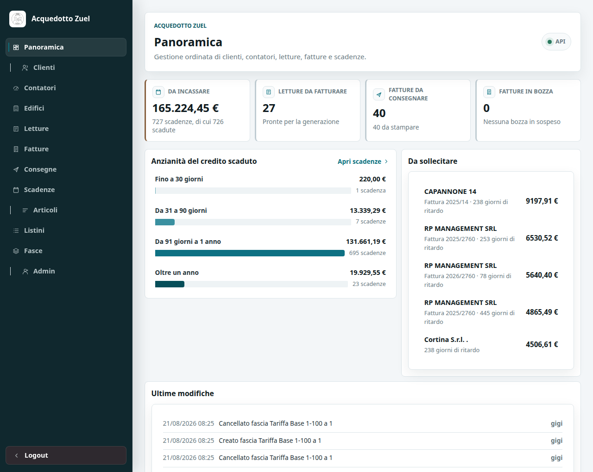
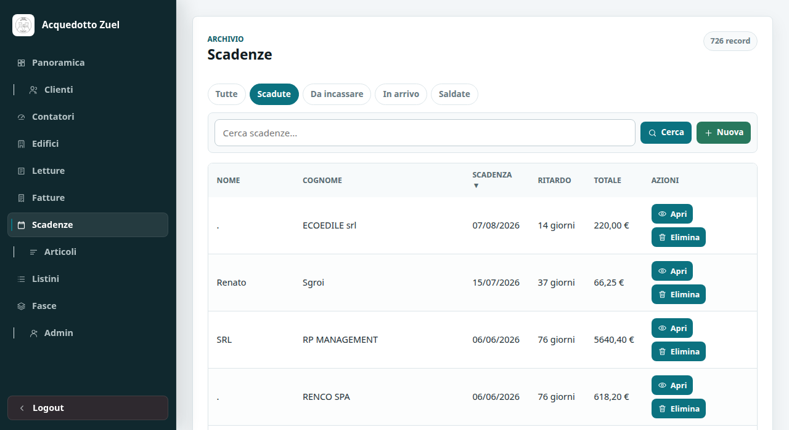
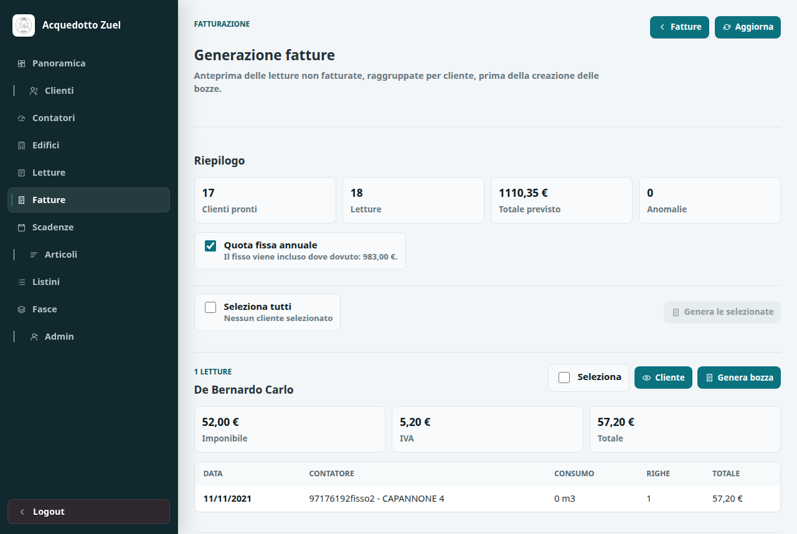
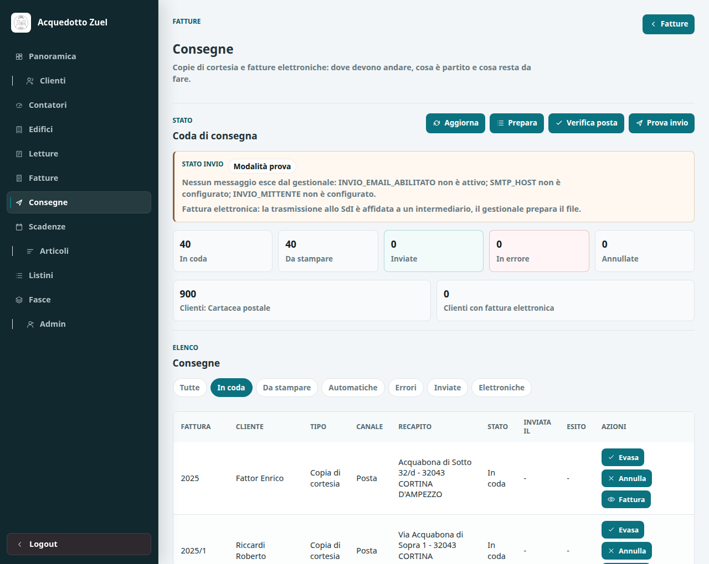

# Prima di iniziare

Questo gestionale tiene insieme tutto il lavoro dell'acquedotto: le anagrafiche dei
soci e dei clienti, i contatori installati negli edifici, le letture dei consumi, le
fatture che ne derivano e gli incassi.

Il programma funziona **dentro il browser**: non c'e nulla da installare sul computer.
Basta una connessione a internet e uno fra Chrome, Edge, Firefox o Safari aggiornati.
Funziona anche da telefono e da tablet: le tabelle diventano schede leggibili sullo
schermo piccolo.

## L'indirizzo

Il gestionale si apre a questo indirizzo:

```
https://acquedotto-cortina-client.netlify.app
```

Conviene salvarlo fra i preferiti del browser.

## Chi può fare cosa

Esistono due tipi di accesso.

| Tipo | Chi lo usa | Cosa vede |
|------|------------|-----------|
| Amministratore | Proprietario, segreteria | Tutto il gestionale |
| Cliente | I clienti dell'acquedotto | Solo i propri dati: contatori, letture, fatture |

Gli accessi dei clienti si creano dalla scheda del singolo cliente, come spiegato più
avanti. Il cliente non può modificare nulla: può solo consultare e scaricare le proprie
fatture.

> **Nota.** I dati sono conservati online e restano disponibili da qualunque
> postazione. Non serve fare copie sul proprio computer.

---

# Entrare e uscire

## Accedere

All'apertura compare la schermata di accesso: si inseriscono nome utente e password e
si preme **Accedi**.

In alto a destra c'e un piccolo indicatore con la scritta **API**: quando il pallino e
verde il gestionale sta comunicando correttamente con il server. Se è rosso, vedere il
capitolo *Se qualcosa non funziona*.

Passandoci sopra il puntatore compaiono le versioni in uso, per esempio
*API online - server 2.0.0 - interfaccia 2.0.0*. Sono utili quando si segnala un
problema: vanno riportate insieme alla descrizione.

## La sessione scade

Per sicurezza l'accesso resta valido **otto ore**. Dopo, il gestionale riporta alla
schermata di accesso spiegando che la sessione è scaduta: basta rientrare con le stesse
credenziali. Il lavoro già salvato non si perde mai, perché ogni modifica viene
registrata nel momento in cui si preme il pulsante di salvataggio.

## Uscire

In fondo al menu a sinistra c'e **Logout**. Conviene usarlo quando si lascia un computer
condiviso.

## Cambiare la propria password

Dal menu, voce **Admin**, si aprono i dati del proprio accesso: si possono cambiare nome
utente, email, numero di telefono e password.

---

# Com'è fatto il gestionale

## Il menu

Il menu a sinistra è diviso in due parti, separate da una linea.

- **La parte alta è il lavoro di tutti i giorni:** Clienti, Contatori, Edifici, Letture,
  Fatture, Consegne, Scadenze.
- **La parte bassa riguarda le tariffe:** Articoli, Listini, Fasce. Sono le voci che si
  toccano una o due volte l'anno, quando cambiano i prezzi.

Su telefono il menu si apre con il pulsante a tre righe in alto a destra.

## La panoramica

La prima schermata, **Panoramica**, è il punto di partenza della giornata. In alto
mostra quattro numeri, e ognuno è cliccabile e porta direttamente all'elenco
corrispondente:

- **Da incassare** — quanto denaro è ancora da riscuotere e su quante scadenze;
- **Letture da fatturare** — quante letture aspettano di diventare fattura;
- **Fatture da consegnare** — quante fatture sono state emesse ma non ancora recapitate;
- **Fatture in bozza** — quante fatture sono state create ma non ancora confermate.

Sotto ci sono tre riquadri:

- **Anzianità del credito scaduto**, che mostra da quanto tempo aspettano i soldi non
  ancora incassati, diviso in quattro fasce. Più la barra è scura, più il credito è
  vecchio e difficile da recuperare.
- **Da sollecitare**, con i cinque crediti scaduti più grossi: sono le telefonate da
  fare per prime. Ogni riga porta alla scheda del cliente.
- **Ultime modifiche**, che mostra chi ha cambiato cosa e quando.



*La Panoramica: i numeri in alto portano alla lista corrispondente; sotto, l'anzianità del credito, i solleciti da fare e le ultime modifiche registrate.*

## Gli elenchi

Tutte le voci del menu funzionano allo stesso modo.

**I filtri** sono i pulsanti arrotondati sopra l'elenco: scelgono cosa vedere. Per
esempio, in Scadenze si può scegliere fra *Scadute*, *Da incassare*, *In arrivo* e
*Saldate*. Il filtro attivo è evidenziato; **Tutte** toglie il filtro.

**La ricerca** è la casella accanto: si scrive una parola e si preme il pulsante di
ricerca. Cerca in tutti i campi della scheda, quindi funziona con un cognome, un
indirizzo, un numero di matricola.

**L'ordinamento** si cambia cliccando sull'intestazione di una colonna. Un secondo clic
inverte l'ordine.

**Le pagine** si scorrono con i pulsanti in fondo all'elenco.

> **Suggerimento.** L'indirizzo nella barra del browser tiene conto di filtro, pagina e
> ordinamento. Si può quindi salvare fra i preferiti una vista usata spesso, per esempio
> le scadenze scadute, e ritrovarla con un clic.



*L'elenco delle scadenze con il filtro «Scadute» attivo. La colonna del ritardo è calcolata ogni giorno, non memorizzata.*

**Apri** entra nella scheda del record. **Elimina** lo cancella, sempre chiedendo
conferma. **Nuovo** crea una scheda vuota.

## Le schede

La scheda mostra tutti i dati di un record e, sotto, i collegamenti alle schede
correlate: dal cliente si arriva ai suoi contatori e alle sue fatture, dal contatore alle
sue letture, e così via.

Il pulsante in fondo riporta indietro e ricorda da dove si e arrivati: se si e aperta la
scheda di un contatore partendo da un cliente, dira *Torna alla scheda cliente*.

## Le note e gli allegati

Le schede che hanno un campo **Note** permettono anche di allegare file: fotografie di un
contatore, un documento firmato, un foglio di calcolo. Si accettano immagini, PDF, file
di testo, Word, Excel e OpenDocument, fino a 6 MB ciascuno. Gli allegati restano legati
alla scheda e sono scaricabili da chiunque abbia accesso.

---

# Clienti

La voce **Clienti** contiene l'anagrafica: dati personali, indirizzi di residenza e di
fatturazione, recapiti, codice fiscale e partita IVA, modalita di pagamento, IBAN.

## Filtri utili

- **Soci** — i clienti che sono anche soci della cooperativa.
- **Con email** — utile prima di un invio di comunicazioni.
- **Fattura elettronica** — chi riceve la fattura in formato elettronico.

## Creare un cliente

Si preme **Nuovo** e si compilano i campi. Per una persona fisica si usano *Cognome* e
*Nome*; per una società si compila *Ragione sociale*, che ha la precedenza ovunque
compaia il nome del cliente.

Sono importanti anche:

- **Destinazione e indirizzo di fatturazione**, se la fattura va spedita a un indirizzo
  diverso dalla residenza;
- **Pagamento** e **IBAN**, se il cliente paga con addebito;
- **Email**, indispensabile per dargli accesso all'area riservata e per potergli
  mandare la fattura per posta elettronica;
- **Consegna copia**, cioè come riceve la fattura: posta, email, PEC, sportello o
  niente. Vedi il capitolo *Consegnare le fatture*;
- **Codice destinatario** e **Email PEC**, che sono i recapiti della fattura
  elettronica: li comunica il cliente, non si inventano.

## Dare a un cliente l'accesso all'area riservata

Nella scheda del cliente c'e il riquadro **Accesso portale**. Si inseriscono un nome
utente e una password provvisoria di almeno otto caratteri, e l'accesso è creato. Il
cliente potrà cambiare la password da solo dopo il primo ingresso.

Dallo stesso riquadro si può in seguito **disattivare** l'accesso, senza cancellare
nulla: il cliente non potrà più entrare, ma i suoi dati restano.

## Vedere quanto c'e da fatturare per un cliente

Sempre nella scheda, il riquadro **Calcolo fattura** mostra le letture del cliente non
ancora fatturate e quanto verrebbe la fattura. Da li si può generare direttamente la
bozza per quel singolo cliente.

---

# Contatori ed edifici

## Contatori

Ogni contatore e collegato a tre cose: il **cliente** che lo usa, l'**edificio** dove si
trova e il **listino** con cui si calcolano i suoi consumi.

> **Attenzione.** Un contatore senza listino non può essere fatturato: al momento della
> generazione il gestionale si ferma e lo segnala. Conviene verificarlo appena si
> inserisce un contatore nuovo.

I filtri disponibili sono *Attivi*, *Inattivi* e *Condominiali*.

Il campo **Quota riparto (%)** riguarda solo i contatori condominiali: indica la
percentuale di consumo attribuita a quella utenza. Sui contatori normali si lascia
vuoto.

## Edifici

Gli edifici raccolgono i dati dell'immobile: indirizzo, località, dati catastali, numero
di unità abitative, posti letto.

Se l'edificio ha latitudine e longitudine, compare sulla **mappa** in cima all'elenco.
Cliccando un segnaposto sulla mappa la riga corrispondente viene evidenziata
nell'elenco, e viceversa.

---

# Letture

Le letture sono il punto di partenza della fatturazione: senza letture non ci sono
fatture.

> **Da leggere con attenzione.** Nel campo **Lettura contatore** va scritto il **numero
> che si legge sul quadrante**, cioe il totale progressivo, **non** il consumo del
> periodo. Il consumo da fatturare lo calcola il gestionale come differenza rispetto
> alla lettura precedente dello stesso contatore. Se si inserisse il consumo al posto
> dell'indice, la fattura risulterebbe sbagliata.

## Inserire una lettura

Si preme **Nuovo** dall'elenco Letture, oppure si parte dalla scheda del contatore, che
e più sicuro perché il contatore risulta già collegato. Si compilano:

- **Data lettura** — il giorno del rilevamento;
- **Lettura contatore** — il numero letto sul quadrante;
- **Unità di misura** — normalmente `m3`;
- **Tipo** e **Note** — facoltativi, utili per annotare letture stimate o anomalie.

## Filtri

- **Da fatturare** — le letture che entreranno nella prossima fatturazione;
- **Fatturate** — quelle già diventate fattura.

Una lettura risulta *fatturata* automaticamente quando viene inclusa in una fattura.
Se quella fattura viene cancellata, la lettura torna disponibile.

---

# Fatturare

È l'operazione più importante, e conviene farla nell'ordine descritto qui.

## 1. Controllare cosa e pronto

Dal menu **Fatture** si apre **Genera da letture**, oppure si clicca il riquadro
*Letture da fatturare* nella panoramica.

La pagina raggruppa **per cliente** tutte le letture non ancora fatturate e mostra per
ciascuno l'imponibile, l'IVA e il totale previsto. In cima si vedono i totali generali e
il numero di anomalie.

## 2. Decidere la quota fissa

L'interruttore **Quota fissa annuale** decide se includere la quota fissa nelle fatture
che si stanno per generare. Il gestionale sa già quali contatori l'hanno già pagata
nell'anno in corso e non la applica due volte.

## 3. Generare

Ci sono due modi.

**Un cliente alla volta:** il pulsante *Genera bozza* nel riquadro del cliente. Alla fine
il gestionale apre direttamente la fattura creata.

**Molti clienti insieme:** si spuntano le caselle *Seleziona* dei clienti desiderati,
oppure si usa *Seleziona tutti* in cima, e si preme **Genera N bozze**. Il gestionale
procede un cliente alla volta mostrando l'avanzamento, e si può **interrompere** in
qualsiasi momento: le fatture già create restano.

Alla fine compare un riepilogo con quante bozze sono state create e, soprattutto,
**l'elenco dei clienti non fatturati con il motivo**. Un cliente che fallisce non blocca
gli altri.



*La generazione: in alto il riepilogo e l'interruttore della quota fissa, poi la selezione dei clienti da fatturare insieme.*

## 4. Se un cliente da errore

I motivi più comuni sono:

| Messaggio | Cosa significa | Cosa fare |
|-----------|----------------|-----------|
| Il listino non ha fasce consumo valide per questa data | Il listino del contatore non ha tariffe valide al giorno della lettura | Aggiungere o correggere le fasce del listino |
| Il listino copre X mc su Y mc | Le fasce non coprono tutto il consumo | Estendere la fascia più alta |
| Articolo ACQUA mancante | Manca una voce obbligatoria del catalogo articoli | Contattare l'assistenza |
| La lettura deve avere un contatore con listino associato | Il contatore non ha un listino | Aprire il contatore e assegnarlo |
| Questa lettura usa un riparto condominiale | Va calcolata sul contatore condominiale | Trattare la lettura manualmente |

Le fatture generate nascono sempre come **bozza**: nulla e definitivo finché non si
conferma.

---

# Fatture

## Bozza e confermata

Una fattura nasce **bozza**: si può correggere e cancellare liberamente. Quando i dati
sono giusti la si **conferma**, e da quel momento è un documento emesso.

Una fattura confermata resta protetta: modificarla o cancellarla richiede una
**conferma esplicita**, e il gestionale registra chi lo ha fatto e quando. Serve per
correggere un errore, non per la modifica ordinaria.

I filtri dell'elenco sono *Bozze*, *Confermate* e *Senza scadenza*.

## La numerazione

Le fatture emesse da questo gestionale hanno un numero progressivo che riparte da 1 ogni
anno, e un codice nella forma `2026/A/1`: anno, serie, numero. Le fatture importate dal
vecchio programma mantengono la numerazione di allora e non si mescolano con le nuove.

## Il PDF

Dalla scheda della fattura il pulsante apposito genera il **PDF** pronto da stampare o
inviare, con i dati della cooperativa, gli estremi bancari e il dettaglio delle righe.

## Verificare che i conti tornino

Nella scheda della fattura, il riquadro **Calcolo fattura** confronta le righe salvate
con quello che il listino attuale produrrebbe oggi e segnala le differenze. Da qui si
può anche aggiungere la quota fissa se manca ed e dovuta.

Il riquadro **Storico modifiche** elenca ogni intervento sulla fattura, con l'autore.

## Cancellare una fattura

Cancellando una fattura il gestionale rimuove anche le sue righe e la scadenza
collegata, e **rimette le letture fra quelle da fatturare**. È l'operazione da usare
quando una bozza e sbagliata: si cancella e si rigenera.

---

# Consegnare le fatture

Confermare una fattura non la fa uscire dal gestionale. La consegna è un passo a parte,
e la pagina **Consegne** è il posto dove si vede chi deve ancora ricevere la sua
fattura, per quale strada, e cosa è già partito.

## Le due strade di una fattura

Una fattura può uscire due volte, e le due uscite sono cose diverse.

- **La copia di cortesia** è la fattura che il cliente riceve per leggerla e pagarla:
  per posta, per email, per PEC, oppure ritirata allo sportello. Questa è una **scelta
  vostra**, e si imposta sul cliente.
- **La fattura elettronica** è il documento valido ai fini fiscali, che viaggia
  attraverso il Sistema di Interscambio dell'Agenzia delle Entrate. Qui **non c'è nulla
  da scegliere**: la strada la decide il cliente, in base al codice destinatario o alla
  PEC che ha comunicato. Il gestionale la ricava da solo dai suoi dati.

> **Attenzione.** Le due cose non si sostituiscono a vicenda. Mandare la copia per email
> non toglie l'obbligo della fattura elettronica, e viceversa.

## Scegliere come consegnare a un cliente

Nella scheda del cliente, il campo **Consegna copia** è una tendina con cinque scelte:

| Scelta | Cosa comporta |
|--------|----------------|
| **Cartacea postale** | La fattura va stampata e spedita. È l'impostazione attuale di tutti i clienti. |
| **Email** | Il gestionale invia il PDF all'indirizzo email del cliente. |
| **PEC** | Come sopra, ma alla casella PEC. |
| **Ritiro allo sportello** | La fattura va stampata e tenuta a disposizione. |
| **Nessuna copia** | Nessun invio: resta solo la fattura elettronica. |

Nell'elenco dei clienti i filtri **Consegna: email** e **Consegna: posta** mostrano a
colpo d'occhio chi riceve cosa.

> **Prima di passare all'email serve un indirizzo.** Oggi solo 213 clienti su 900 ne
> hanno uno in anagrafica. Se si sceglie Email per un cliente che non ha l'indirizzo, il
> gestionale non inventa nulla: lo segnala fra le consegne bloccate e non manda niente.

## La pagina Consegne

Si apre dal menu, voce **Consegne**, oppure dal numero *Fatture da consegnare* nella
Panoramica. È divisa in due parti.

**In alto lo stato**: quante consegne sono in coda, quante da stampare, quante già
inviate, quante hanno dato errore. Sopra i numeri, un riquadro colorato dice in che
modalità si trova il gestionale in questo momento.

**Sotto l'elenco**, con i filtri:

- **In coda** — tutto quello che deve ancora uscire;
- **Da stampare** — le fatture cartacee e quelle da ritirare: è la lista di lavoro
  dello sportello;
- **Automatiche** — quelle che partono da sole (email e PEC);
- **Errori** — quelle che non sono riuscite, con il motivo scritto accanto;
- **Inviate** — quello che è già uscito, con la data.



*La pagina Consegne. Il riquadro giallo in alto avvisa che il gestionale è in modalità prova e non sta inviando nulla; i numeri sotto contano cosa resta da fare.*

## I quattro pulsanti

**Prepara** cerca le fatture confermate che non hanno ancora una consegna e le mette in
elenco, ognuna con il recapito del suo cliente. Non manda niente: serve solo a costruire
la lista di cosa andrebbe fatto.

**Invia** percorre la lista e recapita quello che può, cioè le email e le PEC, con il
PDF della fattura allegato. Le fatture cartacee restano in elenco: quelle le stampa e le
imbuca una persona.

**Verifica posta** controlla che il gestionale riesca a parlare con il server di posta,
senza spedire nulla a nessuno.

**Aggiorna** rilegge l'elenco, utile dopo aver corretto qualcosa in anagrafica.

Su ogni riga dell'elenco ci sono poi:

- **Evasa** — per dichiarare fatta a mano una consegna: la busta imbucata, la fattura
  ritirata allo sportello;
- **Riprova** — per rimettere in coda una consegna finita in errore, dopo aver corretto
  il problema (di solito un indirizzo sbagliato);
- **Annulla** — per togliere dalla lista una consegna che non va più fatta. La fattura
  resta invariata.

## Niente parte per sbaglio

Finché il server di posta non è configurato, il gestionale lavora in **modalità prova**:
premendo *Invia* le consegne vengono registrate, i conteggi sono reali, ma **nessun
messaggio esce**. Il riquadro in alto lo dice a chiare lettere, e il pulsante si chiama
*Prova invio* invece di *Invia*.

È voluto: una spedizione a centinaia di clienti partita per errore non si annulla.

Quando si sarà pronti a inviare davvero, la configurazione del server di posta va fatta
da chi cura il sistema — vedi *Assistenza e aggiornamenti* in fondo al manuale.

## La singola fattura

Nella scheda di ogni fattura il riquadro **Dove va questa fattura** mostra la stessa
cosa per quel solo documento: i canali previsti, i recapiti, cosa è già partito e
quando. Da lì si può preparare e inviare la singola fattura, senza passare dall'elenco.

Se la fattura è ancora una bozza il riquadro lo dice: **una bozza non si consegna**, va
prima confermata.

## Come stanno le cose oggi

Alla consegna di questo manuale il gestionale è predisposto ma **non invia nulla**:

- tutti i clienti sono impostati su *Cartacea postale*;
- la fattura elettronica non è ancora attiva su nessun cliente, perché va prima deciso
  come l'acquedotto la trasmette (commercialista, portale dell'Agenzia, oppure canale
  proprio);
- il server di posta non è configurato, quindi la modalità è quella di prova.

Tutto il resto è già al suo posto: quando le decisioni saranno prese, si tratta di
accendere gli interruttori, non di rifare il lavoro.

---

# Scadenze e incassi

Ogni fattura genera una **scadenza**: e li che si tiene traccia dei pagamenti.

I filtri sono:

- **Scadute** — la data è passata e non risultano pagate. È l'elenco da cui partire.
- **Da incassare** — tutte le non pagate, comprese quelle non ancora scadute.
- **In arrivo** — non ancora scadute.
- **Saldate** — già incassate.

## Registrare un pagamento

Si apre la scadenza, si spunta **Saldo** e si inserisce la **Data pagamento**. Il ritardo
smette di crescere e si ferma ai giorni effettivi.

## Il ritardo

Il campo **Ritardo** è calcolato dal gestionale e non si modifica a mano: per le
scadenze non pagate cresce ogni giorno, per quelle pagate resta fermo ai giorni fra
scadenza e pagamento.

Il campo **Solleciti** serve ad annotare quanti avvisi sono già stati mandati.

---

# Tariffe

Sono le tre voci in fondo al menu. Si toccano di rado, ma determinano quanto pagano
tutti i clienti.

## Articoli

Il catalogo delle voci fiscali, ognuna con la propria aliquota IVA. Alcuni codici sono
**obbligatori** perché il calcolo li usa: `ACQUA` e `ACQUAF` per i consumi e la quota
fissa, `COND` e `CONDF` per i contatori condominiali, `GG_DELAY` per la mora.

> **Attenzione.** Non cancellare ne rinominare questi codici: senza di loro la
> generazione delle fatture si ferma.

## Listini

Un listino è un piano tariffario, per esempio *domestico residente* o *società*. Non
contiene prezzi: raccoglie le fasce. Ogni contatore e collegato a un listino.

## Fasce

Le fasce sono gli scaglioni di consumo con il relativo prezzo. Ogni fascia ha un minimo,
un massimo, un prezzo e un periodo di validità.

Gli estremi sono **inclusivi** e le fasce devono essere **contigue**: se una arriva a
100, la successiva parte da 101. Un buco fra le fasce fa fallire la fatturazione con il
messaggio *il listino copre X mc su Y mc*.

Le fasce il cui tipo contiene la parola *fisso* sono la **quota fissa**: valgono una
volta l'anno per contatore, a prescindere dal consumo.

## Cambiare un prezzo

Il modo corretto per aumentare una tariffa da una certa data **non** e modificare la
fascia esistente, ma:

1. mettere una **data di scadenza** alla fascia in vigore, per esempio il 31 dicembre;
2. creare una **nuova fascia** con gli stessi estremi, il prezzo nuovo e la validità che
   inizia il giorno dopo.

Così le fatture vecchie restano ricalcolabili con le tariffe di allora, e le nuove usano
il prezzo aggiornato.

> **Ogni modifica alle tariffe viene registrata.** Il gestionale conserva chi ha
> cambiato cosa, il valore precedente e quello nuovo. Le modifiche compaiono anche nel
> riquadro *Ultime modifiche* della panoramica.

---

# L'area riservata ai clienti

Il cliente che ha ricevuto un accesso entra dallo stesso indirizzo, con le proprie
credenziali, e vede una schermata sola con:

- i propri dati anagrafici e i recapiti;
- i propri contatori;
- le proprie letture più recenti;
- le proprie fatture, con l'importo ancora da pagare in evidenza e il **PDF scaricabile**.

Il cliente non può modificare nulla e non vede in alcun modo i dati degli altri clienti.

---

# Controlli consigliati

## Ogni volta che si fattura

Dopo aver generato le bozze, aprire **Fatture** e usare **Controlli**: il gestionale
elenca le fatture con anomalie, per esempio un totale che non corrisponde alle righe, una
quota fissa dovuta e mancante o un cliente non collegato.

Dopo aver confermato le fatture, aprire **Consegne** e premere **Prepara**: l'elenco
mostra quante buste ci sono da stampare e quante fatture partono da sole. Il filtro
*Errori* segnala i clienti a cui manca il recapito.

## Una volta al mese

Aprire la panoramica e guardare l'**anzianità del credito**. Se la fascia *oltre un anno*
cresce, è il momento di intervenire sui solleciti.

## Prima di una fatturazione importante

Controllare che i listini abbiano fasce valide per l'anno in corso: è la causa più
frequente di generazioni fallite.

Se si è passati all'invio per email, controllare anche il riquadro in alto nella pagina
**Consegne**: dice se il gestionale sta inviando davvero oppure se è in modalità prova.

---

# Se qualcosa non funziona

**Il pallino API e rosso, oppure gli elenchi non si caricano.**
Il gestionale non sta raggiungendo il server. Il servizio potrebbe essere in fase di
riavvio: attendere un minuto e ricaricare la pagina. Se il problema resta, contattare
l'assistenza.

**Mi chiede di accedere di nuovo.**
La sessione dura otto ore, poi scade. È normale: basta rientrare.

**Un elenco sembra vuoto.**
Molto probabilmente e attivo un filtro o una ricerca. Il gestionale lo dice sotto
l'elenco, per esempio *Nessun record nella vista "scadute"*: premere **Tutte** o
svuotare la casella di ricerca.

**Non riesco a modificare una fattura.**
È confermata. Si può comunque intervenire: il gestionale chiede una conferma esplicita e
registra l'operazione.

**Ho cancellato per sbaglio una fattura.**
Le letture collegate sono tornate disponibili, quindi si può rigenerare la fattura dalla
pagina di generazione. Il numero, però, non viene riusato: la nuova fattura avrà il
numero successivo.

**Il totale di una fattura non torna.**
Aprire la fattura e guardare il riquadro *Calcolo fattura*: confronta le righe salvate
con quelle che il listino produrrebbe oggi e indica dove sta la differenza.

**Compare la schermata "Qualcosa e andato storto".**
Un errore ha interrotto la pagina. Il pulsante **Ricarica la pagina** di solito
risolve. Se si ripete sempre nello stesso punto, va segnalato: nella schermata,
sotto *Dettaglio tecnico*, c'e il messaggio da riportare all'assistenza.

**La pagina resta bianca.**
Quasi sempre è il browser che sta riusando una versione vecchia. Si risolve con un
ricaricamento forzato: **Ctrl+Shift+R** (su Mac Cmd+Shift+R). In alternativa si apre
il gestionale in una finestra anonima per verificare.

---

# Assistenza e aggiornamenti

## Per il passaggio dal vecchio sistema

> **Importante.** Il travaso dei dati dal gestionale precedente a questo — anagrafiche,
> contatori, letture, storico delle fatture — **non va eseguito da soli**. E
> un'operazione delicata: un import ripetuto può duplicare i dati o rendere fatturabili
> consumi già fatturati.
>
> **Per qualunque aggiornamento o migrazione dal sistema attuale verso quello nuovo,
> contattare Nicola Zandegiacomo, che se ne occupa direttamente.**

## Per attivare l'invio automatico delle fatture

Perché le fatture partano davvero per email servono due cose che non si impostano
dall'interfaccia: un server di posta configurato e la decisione su come l'acquedotto
trasmette le fatture elettroniche al Sistema di Interscambio.

**Anche per questo il riferimento è Nicola Zandegiacomo.** Fino ad allora il gestionale
resta in modalità prova e non manda niente a nessuno.

## Per tutto il resto

Per malfunzionamenti, richieste di modifica, nuovi accessi o dubbi sull'uso, il
riferimento e sempre lo stesso.

Quando si segnala un problema, aiuta molto indicare:

- cosa si stava facendo e su quale schermata;
- il messaggio comparso, copiato o fotografato;
- il cliente, la fattura o la lettura interessati, con anno e numero;
- le versioni indicate dall'indicatore **API** in alto a destra.

## Questo manuale

Il manuale viene generato da un unico file di testo conservato insieme al programma. Per
aggiornarlo si modifica quel file e si rigenera il PDF: impaginazione, copertina e data
si aggiornano da sole. Le istruzioni tecniche sono nel file `docs/manuale/README.md`.
